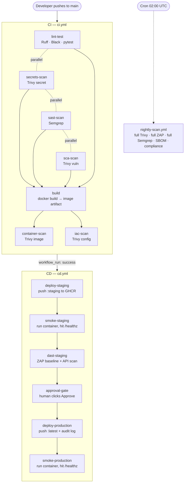

# CloudMart Pipeline Walkthrough — Every Step, Start to Finish

This document traces a single code change from the moment a developer pushes it, all the way to
production, and then through the nightly deep scan — **one job at a time, in the order they run**.

If [`README.md`](./README.md) is the "what" and
[`cloudmart-devsecops-technical-analysis.md`](./cloudmart-devsecops-technical-analysis.md) is the
"why", this file is the **"what happens, in what order, and what stops it"**.

The pipeline is split across three workflow files:

| File | When it runs | What it owns |
|---|---|---|
| [`ci.yml`](./.github/workflows/ci.yml) | Every PR to `main` and every push to `main` | Code-level gates + build the image |
| [`cd.yml`](./.github/workflows/cd.yml) | Automatically, **only after CI succeeds on `main`** | Deploy → smoke → DAST → approval → production |
| [`nightly-scan.yml`](./.github/workflows/nightly-scan.yml) | Cron 02:00 UTC (and manual) | Deep scans, SBOM, licence, compliance evidence |

> **The app under test:** a Python **Flask** app (`src/`) served by **gunicorn on port 8080**,
> packaged as a Docker image. Health endpoint: `GET /healthz`. Home: `GET /`. API spec:
> `GET /openapi.json`.

---

## The whole journey at a glance



Legend for the gate icons used below: 🚫 = **blocks** (job fails, nothing downstream runs) ·
⚠️ = **warns** (records the finding, keeps going) · 📄 = **report only** (no gate).

---

# Part 1 — CI (`ci.yml`)

**Trigger:** `pull_request` → `main`, and `push` → `main`.
**Goal:** prove the change is clean at the code level, then produce a scanned Docker image
artifact for CD to pick up.

The seven jobs run in two waves. Wave 1 (four jobs) runs in parallel the instant the workflow
starts. `build` waits for all four. Then `container-scan` and `iac-scan` run in parallel after
`build`.

```
lint-test ┐
secrets-scan ┤
sast-scan ┤──> build ──> container-scan
sca-scan ┘              └─> iac-scan
```

### Step 1 — `lint-test` — Python CI (Ruff, Black, pytest)

Runs in parallel with the three security scans below.

1. Checks out the repo and sets up Python 3.x (pip cache keyed on `src/requirements.txt`).
2. Installs app deps + `ruff black pytest pytest-cov`.
3. **Ruff** — lint (`ruff check .`).
4. **Black** — formatting check (`black --check .`).
5. **pytest** — unit tests with coverage (`PYTHONPATH=src pytest src/tests --cov=src`).

**Gate:** 🚫 any lint error, formatting drift, or failing test fails the job → `build` never runs.

### Step 2 — `secrets-scan` — Secrets Scan (Trivy)

1. Checks out with **full history** (`fetch-depth: 0`).
2. Caches + installs the Trivy CLI (apt repo).
3. Runs `trivy fs . --scanners secret` → SARIF, uploaded to the **Security tab** (`if: always()`).
4. **Gate step:** re-runs `trivy fs . --scanners secret --exit-code 1`.

**Gate:** 🚫 **any** confirmed secret blocks. No severity threshold — a leaked credential is a
breach regardless of value.

### Step 3 — `sast-scan` — SAST (Semgrep)

Runs inside the pinned `semgrep/semgrep` container.

1. Checks out the repo.
2. `semgrep scan --config=auto --severity=ERROR --severity=WARNING` → SARIF, uploaded to the
   Security tab.
3. **Gate step:** re-runs Semgrep with `--severity=ERROR --error`.

**Gate:** 🚫 any **ERROR**-severity finding blocks. WARNING is reported but does not block.

### Step 4 — `sca-scan` — SCA (Trivy)

1. Checks out; caches + installs Trivy.
2. `trivy fs src --scanners vuln --severity CRITICAL,HIGH --ignore-unfixed` → SARIF, uploaded.
3. **Gate step:** `trivy fs src --scanners vuln --severity CRITICAL --ignore-unfixed --exit-code 1`.

**Gate:** 🚫 **CRITICAL** CVE with a fix available blocks. HIGH is reported; unfixed CVEs are
ignored (nothing to remediate).

### Step 5 — `build` — Docker Build  *(needs: all four jobs above)*

Only starts if `lint-test`, `secrets-scan`, `sast-scan`, and `sca-scan` all passed.

1. Computes an image tag (`github.sha`) and lowercase image name.
2. `docker build -t cloudmart-app:<sha> ./src`.
3. `docker save` → `cloudmart-app.tar`, uploaded as the **`cloudmart-app-image`** artifact
   (retention 1 day). *This tarball is the handoff to CD.*

**Gate:** 🚫 build failure stops everything.

### Step 6 — `container-scan` — Container Scan (Trivy)  *(needs: build)*

1. Downloads and `docker load`s the image tarball.
2. `trivy image ... --scanners vuln,secret --severity CRITICAL,HIGH --ignore-unfixed` → SARIF,
   uploaded.
3. **Gate step:** re-scan for `--severity CRITICAL --exit-code 1`.

**Gate:** 🚫 **CRITICAL** CVE in an image layer (OS packages, base image, bundled deps) blocks.

### Step 7 — `iac-scan` — IaC Scan (Trivy)  *(needs: build)*

Runs in parallel with `container-scan`.

1. Checks out; installs Trivy.
2. `trivy config . --severity CRITICAL,HIGH,MEDIUM` over the Dockerfile → SARIF,
   uploaded.

**Gate:** ⚠️ **WARN only** — `--exit-code 0`, never blocks. Misconfigurations are configuration
debt, tracked in the backlog with a 14-day SLA.

**End of CI.** If every gate passed, the workflow concludes `success` and the scanned image tarball
is sitting in the run's artifacts. That success is the signal CD waits for.

---

# Part 2 — CD (`cd.yml`)

**Trigger:** `workflow_run` on workflow **"CI"**, `types: [completed]`, `branches: [main]`.
Every job is additionally guarded so it only proceeds when CI actually **succeeded**
(`if: github.event.workflow_run.conclusion == 'success'`).

**Goal:** take the exact image CI built, stand it up in staging, attack it, get a human sign-off,
then promote the *same* image to production.

The six jobs run **strictly in sequence** — each `needs:` the previous one:

```
deploy-staging → smoke-staging → dast-staging → approval-gate → deploy-production → smoke-production
```

### Step 8 — `deploy-staging` — Deploy to Staging (GHCR)  *(environment: staging)*

1. Downloads the `cloudmart-app-image` artifact **from the triggering CI run**
   (`run-id: github.event.workflow_run.id`) and `docker load`s it.
2. Logs in to **GHCR** with the built-in `GITHUB_TOKEN`.
3. Tags and pushes two tags: `:staging-<sha>` and `:staging`.
4. Outputs the pinned `:staging-<sha>` image reference for the next jobs.

**Gate:** 🚫 push failure (e.g. missing write permission) stops the deploy chain.

### Step 9 — `smoke-staging` — Smoke Test Staging  *(needs: deploy-staging)*

1. Logs in to GHCR, `docker pull`s the `:staging-<sha>` image.
2. `docker run -d -p 8080:8080` to start the container.
3. Polls `http://localhost:8080/healthz` up to 20× (2s apart) until the app answers.
4. Asserts `/healthz` **and** `/` both return success.
5. Stops the container (`if: always()`).

**Gate:** 🚫 if the app never comes up healthy, the job fails — a broken image never reaches DAST
or production.

### Step 10 — `dast-staging` — DAST (OWASP ZAP)  *(needs: smoke-staging)*

The security centrepiece. ZAP can only test a **running** app, which is why it lives here and not
in CI.

1. Checks out (for the ZAP rules file), logs in to GHCR, pulls and runs the staging image, waits
   for `/healthz`.
2. **ZAP baseline scan** (`zaproxy/action-baseline`) — passive scan of `http://localhost:8080`,
   using `.github/zap/rules.tsv` to suppress known false positives. Uploads the HTML+JSON report
   (retention 90 days).
3. **Gate step:** a Python snippet parses `report_json.json`, counts alerts with `riskcode == '3'`
   (HIGH), and `exit 1` if any exist.
4. **ZAP API scan** (`zaproxy/action-api-scan`) — drives every endpoint in
   `http://localhost:8080/openapi.json`. Uploads its report.
5. Stops the container (`if: always()`).

**Gate:** 🚫 any **HIGH** ZAP finding blocks (CloudMart is public-facing, so this is real risk).
MEDIUM/LOW are tracked. The API scan itself runs in `warn` mode.

### Step 11 — `approval-gate` — Manual Approval  *(environment: production, needs: dast-staging)*

A deliberately trivial job — it just echoes who approved. Its **entire purpose** is the
`environment: production` protection rule: GitHub pauses here until a **required reviewer**
(Security Lead / Release Manager) clicks **Approve** in the Actions UI.

**Gate:** 🚫 nothing proceeds to production until a human approves. (If no required reviewer is
configured on the `production` environment, this auto-passes — see setup docs.)

### Step 12 — `deploy-production` — Deploy to Production (GHCR)  *(needs: deploy-staging + approval-gate)*

1. Downloads and loads the **same** image artifact from the CI run — no rebuild, so what was
   scanned is exactly what ships.
2. Logs in to GHCR.
3. Tags and pushes `:prod-<sha>` and `:latest`.
4. **Writes an audit line** to the job summary: deployed commit SHA, actor, UTC timestamp.

**Gate:** 🚫 push failure stops promotion.

### Step 13 — `smoke-production` — Smoke Test Production  *(needs: deploy-production)*

Same shape as Step 9, against the `:prod-<sha>` image: pull → run → poll `/healthz` → stop. Final
confirmation the promoted image actually boots.

**End of CD.** The change is live, tagged `:latest` in GHCR, with a timestamped audit record and a
passing production smoke test.

---

# Part 3 — Nightly Deep Scan (`nightly-scan.yml`)

**Trigger:** `cron: '0 2 * * *'` (02:00 UTC) + manual `workflow_dispatch`.
**Goal:** run the slow, thorough scans that are too expensive for every commit, and produce
long-lived compliance evidence. **Nothing here blocks** — it feeds the backlog.

Three scan jobs run in parallel, then a summary job fans them in:

```
trivy-full-scan  ┐
semgrep-full-scan ┤──> compliance-summary
zap-active-scan  ┘
```

### Step N1 — `trivy-full-scan` — Trivy Full Scan + SBOM + Licence

- Full `trivy fs .` across `vuln,secret,misconfig`, **all severities**, report only (📄).
- Generates an **SBOM** in both **CycloneDX** and **SPDX** JSON.
- **Licence compliance** scan (`--scanners license`).
- Uploads all four artifacts (retention 90 days).

### Step N2 — `semgrep-full-scan` — Semgrep Full Codebase Scan

- Full `semgrep scan --config=auto` over the whole tree, JSON output, `continue-on-error` (📄).
- Uploads the report (90 days).

### Step N3 — `zap-active-scan` — ZAP Full Active Scan

- Pulls the `:staging` image from GHCR, runs it, waits for `/healthz`.
- **Active** scan (`zaproxy/action-full-scan`) — injects real attack payloads (SQLi, XSS, path
  traversal…). Slow (15–30 min) and destructive, so it only ever runs against the isolated staging
  container, never production. `fail_action: warn` (📄).
- Uploads the report; stops the container.

### Step N4 — `compliance-summary` — Compliance Summary  *(needs: all three)*

- Downloads every nightly artifact.
- Builds a dated `compliance-summary.txt` (timestamp, commit, inventory of collected artefacts).
- Uploads it with **365-day retention** for audit.

---

## Where to watch it happen

| You want to see… | Look here |
|---|---|
| Live job graph, pass/fail, logs | **Actions** tab → the workflow run |
| Every security finding (SARIF) | **Security** tab → Code scanning alerts (filter by tool/severity) |
| ZAP reports, SBOMs, licence, compliance summary | **Actions** → the run → **Artifacts** |
| The production deploy audit line | **Actions** → the `deploy-production` run → **Summary** |
| The pause for human approval | **Actions** → the CD run → the `approval-gate` job → **Review deployments** |

## The gate rules, condensed

| Stage | Job | Gate |
|---|---|---|
| CI | lint-test | 🚫 lint / format / test failure |
| CI | secrets-scan | 🚫 any secret |
| CI | sast-scan | 🚫 Semgrep ERROR |
| CI | sca-scan | 🚫 fixed CRITICAL CVE |
| CI | container-scan | 🚫 CRITICAL CVE in image |
| CI | iac-scan | ⚠️ warn only |
| CD | smoke-staging / -production | 🚫 app not healthy |
| CD | dast-staging | 🚫 ZAP HIGH |
| CD | approval-gate | 🚫 until human approves |
| Nightly | all | 📄 report only |

---

*Companion docs: [`README.md`](./README.md) (overview) ·
[`HOW-TO-RUN.md`](./HOW-TO-RUN.md) (setup & triggering) ·
[`cloudmart-devsecops-technical-analysis.md`](./cloudmart-devsecops-technical-analysis.md) (design rationale).*
