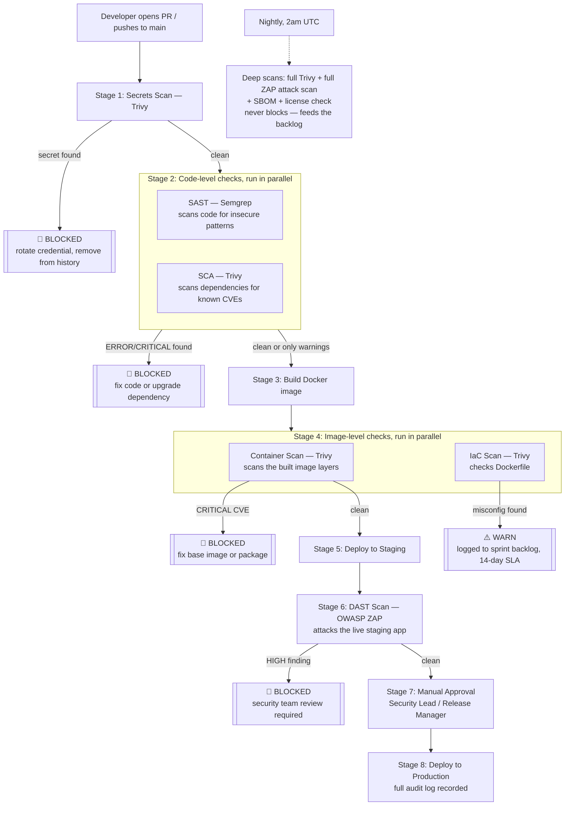

# CloudMart DevSecOps Pipeline

This repository defines a **DevSecOps CI/CD pipeline** for CloudMart — a plan for automatically
catching security problems (leaked passwords, vulnerable dependencies, insecure code, risky
container images, and live application bugs) *before* they reach production, without slowing
down releases more than necessary.

The full reasoning behind every decision — why each tool was picked, what blocks a release vs.
what just gets logged, who's responsible for what — lives in
[`cloudmart-devsecops-technical-analysis.md`](./cloudmart-devsecops-technical-analysis.md).
This README is the short version.

> **Status:** implemented and runnable. `.github/workflows/*.yml`, a minimal Python **Flask** sample
> app (`src/`, served by gunicorn on port 8080), and its `Dockerfile` all exist in this repo — see
> [How to run this](#how-to-run-this) below, or the full step-by-step guide in
> [`HOW-TO-RUN.md`](./HOW-TO-RUN.md). For a job-by-job trace of the whole pipeline from push to
> production, see [`PIPELINE-WALKTHROUGH.md`](./PIPELINE-WALKTHROUGH.md).

---

## What problem does this solve?

Before this pipeline, security checks were manual, inconsistent, and happened too late:

- A live API key was accidentally committed to source control.
- A critical vulnerability shipped in a dependency because no one had a clear "block or ship?" rule.
- Bugs found by scanning the *running* app (DAST) were only discovered after the release was
  already built — making them expensive to fix.

The pipeline fixes this by scanning at every stage automatically, and by giving every finding a
clear, pre-agreed outcome: **block the release**, **warn and track it**, or **accept and log it**.

## The three tools, in plain terms

| Tool | What it checks | Analogy |
|---|---|---|
| **Trivy** | Secrets, vulnerable dependencies, vulnerable container images, misconfigured infrastructure files | A metal detector + background check for everything you're about to ship |
| **Semgrep** | The application's own source code, looking for insecure patterns (SQL injection, hardcoded crypto keys, missing auth checks, etc.) | A proofreader that knows what security bugs look like |
| **OWASP ZAP** | The actual running application/API, by poking at it like an attacker would | A penetration tester that only works once the app is live |

All three are free/open-source and run inside GitHub Actions — no extra servers to buy or maintain.

## How a change moves through the pipeline



### The short version of the gate rules

| Severity | What happens |
|---|---|
| **Any secret found, anywhere** | Always blocks. No exceptions — a leaked credential is a breach regardless of "severity." |
| **Critical vulnerability, no fix available** | Doesn't block — there's nothing actionable to do, so it's logged and watched for a future patch. |
| **Critical vulnerability, fix available** | Blocks. |
| **High severity, public-facing** | Warns with a 7-day fix deadline; doesn't block the release. |
| **Infrastructure misconfiguration (IaC)** | Always warns, never blocks — it's a hardening gap, not an active exploit. |
| **DAST finding against the live app** | HIGH blocks (CloudMart is public-facing, so this is realistic risk); MEDIUM/LOW just get tracked. |

Full details, including the exception-request process for overriding a block, are in section 6 of
the [technical analysis](./cloudmart-devsecops-technical-analysis.md#6-gate-decision-framework).

## Where things live

```
.
├── .github/
│   ├── workflows/
│   │   ├── ci.yml                   # every PR / push to main — lint+test, secrets, SAST, SCA, build, container/IaC scan
│   │   ├── cd.yml                   # auto-runs after CI succeeds on main — deploy staging → smoke → ZAP DAST → approval → production
│   │   └── nightly-scan.yml         # runs at 2am UTC daily — deep scans, SBOM, license check, compliance report
│   └── zap/
│       └── rules.tsv                # suppresses known ZAP false positives
└── src/                             # minimal Python Flask sample app the pipeline builds, scans, and deploys
    ├── app/__init__.py              # Flask app factory — routes: / , /about , /healthz , /openapi.json
    ├── app/templates/               # index.html, about.html
    ├── tests/test_app.py            # pytest unit tests run in CI
    ├── wsgi.py                      # gunicorn entrypoint
    ├── openapi.json                 # API spec ZAP's API scan consumes
    ├── requirements.txt
    └── Dockerfile                   # python:3.13-slim, gunicorn on :8080, non-root user
```

> **Note:** DAST (ZAP) now lives inside `cd.yml`, not a separate `dast-scan.yml` — it runs against
> the freshly deployed staging container as part of the deploy chain.

## Rollout plan (why it isn't "on" everywhere immediately)

Turning on every block at once would stop most releases on day one just from backlog noise. So
the plan is phased:

1. **Weeks 1–2:** everything runs, nothing blocks — just to see what the current findings baseline looks like.
2. **Weeks 3–4:** turn on blocking for secrets and SAST errors (the highest-confidence, least-noisy checks) and rotate the exposed API key.
3. **Weeks 5–6:** turn on blocking for dependency/container CVEs and DAST HIGH findings, and require a named approver before production.
4. **Ongoing:** tune false positives, add CloudMart-specific Semgrep rules, build a KPI dashboard.

## How to run this

The implementation trades the original doc's "external staging URL" for something that runs
**without any cloud account or paid infrastructure**: the staging image is pushed to
[GitHub Container Registry](https://ghcr.io) (free, built into every repo) and the DAST workflow
pulls it and runs it directly on the GitHub Actions runner with `docker run`, then points ZAP at
`http://localhost:8080`. Same coverage, zero infrastructure cost — matching the "no additional
infra" constraint from the design doc even more literally than originally planned.

### One-time setup

1. **Enable GitHub Actions** on this repo (Settings → Actions → General → allow all actions).
2. **Allow GITHUB_TOKEN to publish packages**: Settings → Actions → General → Workflow
   permissions → "Read and write permissions". This lets the pipeline push images to GHCR
   without any extra secret.
3. **Create two GitHub Environments** (Settings → Environments):
   - `staging` — no protection rules needed.
   - `production` — add at least one **required reviewer** (you, standing in for the Security
     Lead / Release Manager) so the approval gate actually pauses for a human.
4. *(Optional)* Add a `SEMGREP_APP_TOKEN` secret if you want Semgrep results to also appear in
   Semgrep Cloud — the pipeline runs fine without it using the free OSS engine.

### Triggering a run

- **Open a PR or push to `main`** → runs `ci.yml` (lint+test, secrets, SAST, SCA, build,
  container/IaC scan). This is the fast feedback loop; it does not deploy.
- **`cd.yml`** fires automatically once `ci.yml` **succeeds on `main`** (via `workflow_run`). It
  goes staging deploy → smoke test → ZAP DAST → your manual approval click → production deploy →
  production smoke test.
- **`nightly-scan.yml`** runs on its own at 02:00 UTC, or trigger it manually from the Actions tab
  (`workflow_dispatch`) to see the SBOM/license/full-scan artefacts without waiting.

Every run's findings land in the **Security tab** (SARIF) and as downloadable **Artifacts** on the
workflow run page (ZAP HTML/JSON reports, SBOMs, compliance summary).

### Trying it locally first

```bash
docker build -t cloudmart-app:local ./src
docker run -d -p 8080:8080 --name cloudmart-local cloudmart-app:local
curl http://localhost:8080/healthz          # {"status":"ok"}
# open http://localhost:8080/ in a browser
docker stop cloudmart-local && docker rm cloudmart-local
```
