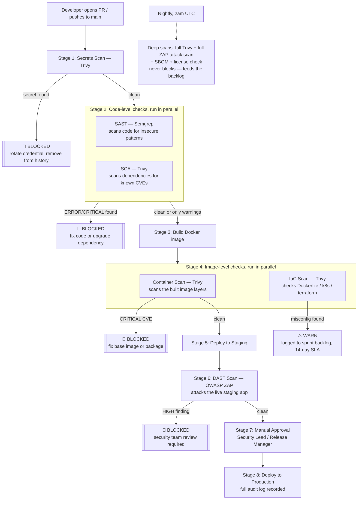

# CloudMart DevSecOps Pipeline

This repository defines a **DevSecOps CI/CD pipeline** for CloudMart — a plan for automatically
catching security problems (leaked passwords, vulnerable dependencies, insecure code, risky
container images, and live application bugs) *before* they reach production, without slowing
down releases more than necessary.

The full reasoning behind every decision — why each tool was picked, what blocks a release vs.
what just gets logged, who's responsible for what — lives in
[`cloudmart-devsecops-technical-analysis.md`](./cloudmart-devsecops-technical-analysis.md).
This README is the short version.

> **Status:** this is the design/blueprint stage. The pipeline is documented but the actual
> `.github/workflows/*.yml` files, `Dockerfile`, and infrastructure manifests it describes have
> not been built yet.

---

## What problem does this solve?

Before this pipeline, security checks were manual, inconsistent, and happened too late:

- A live API key was accidentally committed to source control.
- A critical vulnerability shipped in a dependency because no one had a clear "block or ship?" rule.
- Bugs found by scanning the *running* app (DAST) were only discovered after the release was
  already built — making them expensive to fix.

The pipeline fixes this by scanning at every stage automatically, and by giving every finding a
clear, pre-agreed outcome: **block the release**, **warn and track it**, or **accept and log it**.

## The three tools, in plain terms

| Tool | What it checks | Analogy |
|---|---|---|
| **Trivy** | Secrets, vulnerable dependencies, vulnerable container images, misconfigured infrastructure files | A metal detector + background check for everything you're about to ship |
| **Semgrep** | The application's own source code, looking for insecure patterns (SQL injection, hardcoded crypto keys, missing auth checks, etc.) | A proofreader that knows what security bugs look like |
| **OWASP ZAP** | The actual running application/API, by poking at it like an attacker would | A penetration tester that only works once the app is live |

All three are free/open-source and run inside GitHub Actions — no extra servers to buy or maintain.

## How a change moves through the pipeline



### The short version of the gate rules

| Severity | What happens |
|---|---|
| **Any secret found, anywhere** | Always blocks. No exceptions — a leaked credential is a breach regardless of "severity." |
| **Critical vulnerability, no fix available** | Doesn't block — there's nothing actionable to do, so it's logged and watched for a future patch. |
| **Critical vulnerability, fix available** | Blocks. |
| **High severity, public-facing** | Warns with a 7-day fix deadline; doesn't block the release. |
| **Infrastructure misconfiguration (IaC)** | Always warns, never blocks — it's a hardening gap, not an active exploit. |
| **DAST finding against the live app** | HIGH blocks (CloudMart is public-facing, so this is realistic risk); MEDIUM/LOW just get tracked. |

Full details, including the exception-request process for overriding a block, are in section 6 of
the [technical analysis](./cloudmart-devsecops-technical-analysis.md#6-gate-decision-framework).

## Where things live once built

```
.
├── .github/
│   ├── workflows/
│   │   ├── devsecops-pipeline.yml   # runs on every PR / push — secrets, SAST, SCA, build, container/IaC scan, deploy to staging
│   │   ├── dast-scan.yml            # runs after staging deploy — ZAP against the live app
│   │   └── nightly-scan.yml         # runs at 2am UTC daily — deep scans, SBOM, license check, compliance report
│   └── zap/
│       └── rules.tsv                # suppresses known ZAP false positives
├── Dockerfile
├── k8s/
└── terraform/
```

## Rollout plan (why it isn't "on" everywhere immediately)

Turning on every block at once would stop most releases on day one just from backlog noise. So
the plan is phased:

1. **Weeks 1–2:** everything runs, nothing blocks — just to see what the current findings baseline looks like.
2. **Weeks 3–4:** turn on blocking for secrets and SAST errors (the highest-confidence, least-noisy checks) and rotate the exposed API key.
3. **Weeks 5–6:** turn on blocking for dependency/container CVEs and DAST HIGH findings, and require a named approver before production.
4. **Ongoing:** tune false positives, add CloudMart-specific Semgrep rules, build a KPI dashboard.

## Required setup (once the workflows exist)

Two GitHub secrets need to be configured under **Settings → Secrets and variables → Actions**:

| Secret | Purpose |
|---|---|
| `SEMGREP_APP_TOKEN` | Optional — connects Semgrep scans to Semgrep Cloud |
| `STAGING_URL` | The URL OWASP ZAP scans for DAST |

And a **production environment** (Settings → Environments → `production`) needs at least one
required reviewer (Security Lead or Release Manager) so no one can skip the manual approval gate.
