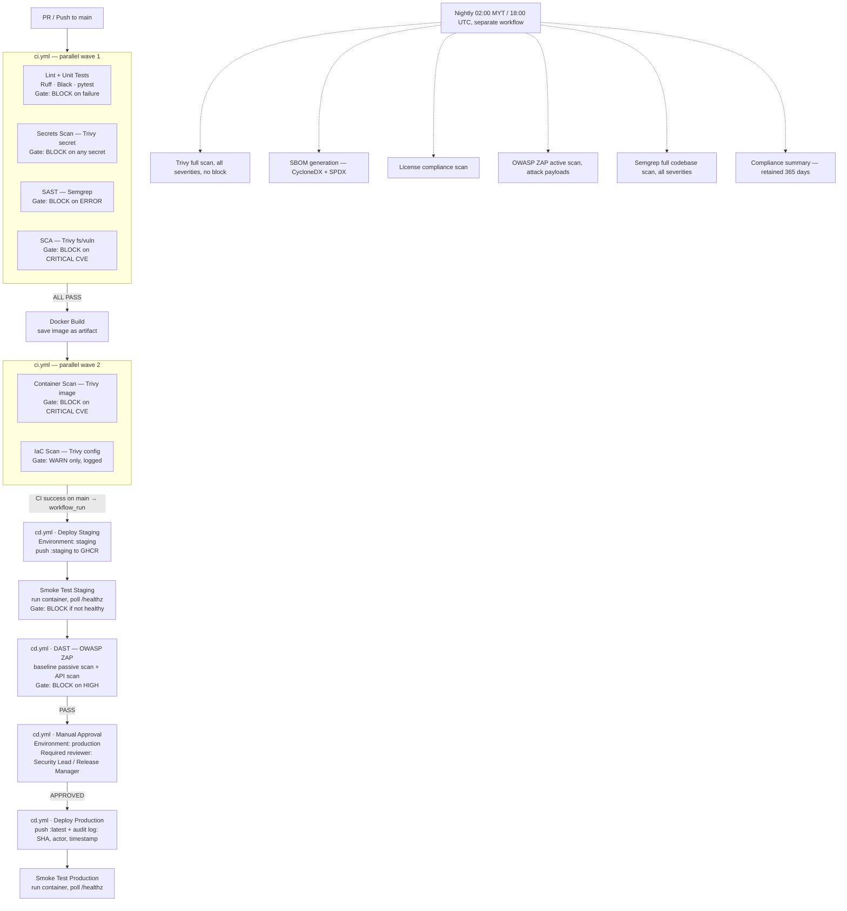
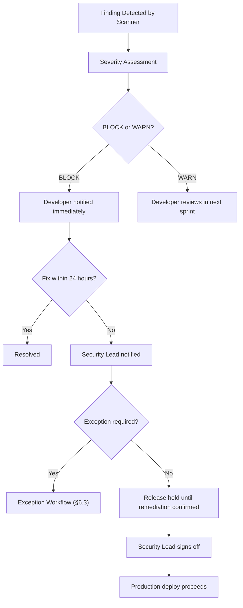

# CloudMart DevSecOps — Technical Analysis

**Project:** CloudMart DevSecOps Transformation
**Scope:** Pipeline Design, Tool Justification, Gate Decisions, Governance
**Pipeline Owner:** Security Engineering
**Platform:** GitHub Actions
**Last Updated:** July 2026

---

## Table of Contents

1. [Executive Summary](#1-executive-summary)
2. [Current-State Analysis](#2-current-state-analysis)
3. [Target Pipeline Architecture](#3-target-pipeline-architecture)
4. [Security Tool Stack](#4-security-tool-stack)
   - 4.1 [Trivy — Multi-Mode Scanner](#41-trivy--multi-mode-scanner)
   - 4.2 [Semgrep — SAST](#42-semgrep--sast)
   - 4.3 [OWASP ZAP — DAST](#43-owasp-zap--dast)
5. [Pipeline File Reference](#5-pipeline-file-reference)
6. [Gate Decision Framework](#6-gate-decision-framework)
7. [Governance and Compliance](#7-governance-and-compliance)
8. [Security Coverage Map](#8-security-coverage-map)
9. [KPIs and Measurement](#9-kpis-and-measurement)
10. [Trade-offs and Constraints](#10-trade-offs-and-constraints)
11. [Implementation Priority](#11-implementation-priority)

---

## 1. Executive Summary

CloudMart Solutions operates a public-facing web application, an internal admin portal, REST APIs, and containerised backend services. The organisation is under pressure to accelerate release velocity while managing growing security and compliance risk.

The current pipeline covers only build and unit testing. Security checks are inconsistent, performed late, and produce untriaged reports that no team has a defined process to act on. A live API key was committed to source control. A critical CVE was found in a dependency with no clear release decision process. DAST findings arrive after the release candidate is already built. Infrastructure is partly manual, producing insufficient audit evidence.

This document defines a DevSecOps transformation model that:

- Embeds automated security scanning at every stage of the CI/CD pipeline
- Defines a risk-based gate decision framework that distinguishes between block, warn, and accept-with-tracking outcomes
- Produces machine-readable audit evidence at every pipeline run
- Assigns clear ownership across Development, Security, Operations, and Product teams
- Maintains delivery velocity by applying proportionate controls — not blocking on every finding

The selected tool stack is **Trivy** (secrets, SCA, container, IaC), **Semgrep** (SAST), and **OWASP ZAP** (DAST), all integrated via GitHub Actions with zero additional infrastructure cost.

---

## 2. Current-State Analysis

### 2.1 Identified Gaps

| Gap | Description | Business Risk |
|-----|-------------|---------------|
| **No secrets scanning** | API key committed to source control; rotation status unclear | Credential compromise, unauthorised API access, potential data breach |
| **No SAST** | Source code is not analysed for insecure patterns before build | Injection flaws, authentication bypasses, insecure crypto reach production undetected |
| **Inconsistent SCA** | Dependency scans run ad hoc with no release gate | Critical CVEs in third-party libraries shipped to production |
| **No container scanning** | Docker images built without OS or layer-level CVE analysis | Base image vulnerabilities (e.g. OpenSSL, glibc) bypass all code-level scanning |
| **No IaC scanning** | Infrastructure partly manual, partly scripted without validation | Misconfigurations (exposed ports, root containers, disabled TLS) deployed silently |
| **Late DAST** | ZAP or equivalent runs after release candidate is ready | Findings require rollback rather than pre-release fix; increases remediation cost |
| **No triage standard** | Large scanner reports delivered with no severity classification | Developer alert fatigue; critical findings deprioritised alongside noise |
| **No release gate process** | No defined policy on what blocks vs warns vs is accepted | Teams cannot make consistent, auditable release decisions |
| **Weak audit evidence** | Manual infrastructure steps leave no trail | Compliance failures during audit; inability to reconstruct deployment history |
| **Siloed teams** | Security, Dev, Ops, and Leadership have conflicting priorities | Security debt accumulates; incidents escalate due to no escalation model |

### 2.2 Root Cause Assessment

The gaps above share a common root cause: security is treated as a post-development activity owned by a separate security team, rather than a continuous property of the pipeline itself. The result is that:

- Security findings arrive too late to be cheap to fix
- No single team has accountability for a finding from detection through to remediation
- There is no automated enforcement mechanism — controls depend on individual discipline
- Audit evidence depends on manual documentation that is incomplete by nature

The target state inverts this model: security checks are automated, embedded at the earliest feasible stage, and produce structured output that drives gate decisions without human triage at every step.

---

## 3. Target Pipeline Architecture

### 3.1 Pipeline Stage Map



### 3.2 Why Three Workflows

The pipeline is split across three GitHub Actions workflow files by design, not for convenience.

| Workflow File | Trigger | Purpose |
|---|---|---|
| `ci.yml` | Every PR + push to `main` | Lint + unit tests, code-level security gates (secrets, SAST, SCA), Docker build, container + IaC scan |
| `cd.yml` | `workflow_run` after **CI succeeds on `main`** | Deploy to staging → smoke test → ZAP DAST → manual approval → deploy to production → smoke test |
| `nightly-scan.yml` | Cron 02:00 Malaysia Time / 18:00 UTC daily | Deep scans too slow for every commit; SBOM; compliance evidence |

**CI / CD separation.** Continuous Integration (prove the change is good) and Continuous Delivery
(ship it) are separate concerns with different triggers and permissions. `ci.yml` runs on every PR
and needs only read + `security-events` scope. `cd.yml` runs *only* after CI concludes `success` on
`main` (`workflow_run`), needs `packages: write` to push to GHCR, and gates its jobs behind GitHub
Environments. Splitting them keeps PR feedback fast and read-only, and confines deploy privileges to
the CD workflow.

**Why ZAP lives in CD, not CI.** A DAST scanner operates against a *running* application — it cannot
scan source code or a Docker image. It therefore runs in `cd.yml`, against the staging container that
`deploy-staging` just stood up, *after* the smoke test confirms the app is healthy. Placing ZAP in CI
before deployment would be technically impossible; running it against a full staging environment per
PR branch is outside CloudMart's constraints. The nightly workflow adds a slower, destructive
**active** ZAP scan against the persistent `:staging` image.

---

## 4. Security Tool Stack

### 4.1 Trivy — Multi-Mode Scanner

**Developer:** Aqua Security | **Licence:** Apache 2.0 | **GitHub Stars:** 34,700+

#### Why Trivy

The capstone rubric requires four distinct scan types: secrets scanning, SCA, container scanning, and IaC scanning. Trivy fulfils all four through a single binary with a consistent CLI interface and unified SARIF output format.

Using one tool for four functions reduces pipeline complexity (one GitHub Action, one vulnerability database, one update schedule) and produces consistent output that uploads to a single GitHub Security dashboard without additional aggregation tooling.

Trivy is the default scanning engine for GitLab CI, Harbor container registry, Artifact Hub, and is certified by RedHat — demonstrating production-grade reliability across enterprise environments.

#### Scan Mode Breakdown

**Mode A — Secrets Scanning**

```yaml
- uses: aquasecurity/trivy-action@master
  with:
    scan-type: fs
    scan-ref: .
    scanners: secret
    exit-code: 1        # BLOCK on any finding
```

Addresses the CloudMart scenario's explicit incident: a live API key committed to source control. Trivy's secret scanner detects hardcoded credentials, API keys, tokens, private keys, and passwords by scanning the source filesystem before any build artefact is created. A secret in Git history is permanently exposed regardless of later deletion — catching it at Stage 1 prevents it from being embedded in the codebase at all.

> **Note:** `scan-type: fs` with `scan-ref: .` only scans the current working tree, not the full git history. For the already-committed API key incident described in this scenario, a one-time full-history scan (or a dedicated history-aware tool such as gitleaks/trufflehog) plus mandatory credential rotation is required in addition to this ongoing check.

**Mode B — Software Composition Analysis (SCA)**

```yaml
- uses: aquasecurity/trivy-action@master
  with:
    scan-type: fs
    scan-ref: .
    scanners: vuln
    severity: CRITICAL,HIGH
    ignore-unfixed: true
    exit-code: 1        # BLOCK on CRITICAL; HIGH reported but does not block
```

Scans package manifests (package.json, requirements.txt, pom.xml, go.sum, Gemfile.lock, etc.) against the Aqua Vulnerability Database for known CVEs. The `ignore-unfixed` flag excludes CVEs with no available patch — blocking a release for a vulnerability that cannot be remediated is not rational and conflicts with CloudMart's delivery constraint.

**Mode C — Container Image Scanning**

```yaml
- uses: aquasecurity/trivy-action@master
  with:
    scan-type: image
    image-ref: cloudmart-app:${{ github.sha }}
    scanners: vuln,secret
    severity: CRITICAL,HIGH
    ignore-unfixed: true
    exit-code: 1
```

A Docker image is not simply application code. It includes a base OS layer, system libraries, and runtime dependencies that may contain CVEs independent of the application. This scan analyses every image layer — including OS packages (Alpine, Debian, Ubuntu) and language-level dependencies bundled into the image.

**Mode D — IaC Misconfiguration Scanning**

```yaml
- uses: aquasecurity/trivy-action@master
  with:
    scan-type: config
    scan-ref: .
    severity: CRITICAL,HIGH,MEDIUM
    exit-code: 0        # WARN only — does not block
```

Analyses the Dockerfile against CIS benchmarks and container hardening guidelines. Common findings include containers running as root, privileged mode enabled, and missing resource limits. Gate is set to WARN only — IaC misconfigurations represent configuration debt rather than an immediately exploitable condition. Findings are assigned a remediation SLA in the sprint backlog.

**Nightly Additions**

The nightly workflow adds two Trivy capabilities not used in the main pipeline:

- **SBOM generation** in CycloneDX and SPDX formats — provides supply chain transparency, supports US EO 14028 compliance, and enables rapid response when new CVEs are disclosed against known dependencies
- **License compliance scanning** — identifies GPL, AGPL, and other copyleft licences in dependencies that may conflict with CloudMart's commercial distribution

---

### 4.2 Semgrep — SAST

**Developer:** Semgrep Inc. | **Licence:** LGPL 2.1 (OSS engine) | **Type:** Static Application Security Testing

#### Why Semgrep

SAST is a mandatory rubric requirement and covers a category of vulnerability that Trivy and ZAP cannot detect: insecure logic patterns within source code.

- Trivy scans artefacts and known CVEs — it does not read application logic
- ZAP scans a running application — it cannot see the code that produces it
- Semgrep reads the code itself, identifying patterns that will produce vulnerabilities at runtime

Semgrep was selected over SonarQube because SonarQube requires a persistent server instance. Semgrep runs as a container in GitHub Actions with zero infrastructure. It was selected over Checkmarx and Veracode because those are commercial products — Semgrep OSS is free, consistent with CloudMart's automation requirements.

#### How It Works

```yaml
- name: Run Semgrep SAST
  run: |
    semgrep scan \
      --config=auto \
      --sarif \
      --output=semgrep-results.sarif \
      --severity=ERROR \
      --severity=WARNING \
      --error
  env:
    SEMGREP_APP_TOKEN: ${{ secrets.SEMGREP_APP_TOKEN }}
```

The `--config=auto` flag detects the project's language(s) and framework(s) and automatically applies the most appropriate rule sets — covering OWASP Top 10 patterns, framework-specific insecurities, and common CWE categories without manual rule authoring.

The `--error` flag causes a non-zero exit on ERROR-severity findings, which GitHub Actions interprets as a pipeline failure.

On pull requests, Semgrep scans only the changed files (diff-aware scanning), completing in under two minutes. The nightly workflow runs a full codebase scan at all severity levels for comprehensive visibility.

#### Vulnerability Classes Detected

| Class | Example |
|-------|---------|
| SQL Injection | User input passed to raw SQL query without parameterisation |
| Command Injection | User input passed to `os.system()`, `subprocess.call()` |
| XSS | Unescaped user input rendered in HTML response |
| Insecure Cryptography | MD5/SHA1 for password hashing, hardcoded AES keys |
| Authentication Flaws | Missing auth checks on route handlers, weak JWT validation |
| Sensitive Data Exposure | Passwords or tokens written to logs |
| Insecure Deserialisation | Untrusted data passed to `pickle.loads()`, `yaml.load()` |
| Path Traversal | User-controlled filename used in file system operations |

---

### 4.3 OWASP ZAP — DAST

**Developer:** OWASP / Checkmarx | **Licence:** Apache 2.0 | **Type:** Dynamic Application Security Testing

#### Why OWASP ZAP

DAST is the only scanning category that tests what actually runs — not what the code says or what the image contains. A perfectly clean SAST and SCA result does not guarantee that the deployed application behaves securely. Runtime configuration, server headers, session management, and authentication flows only exist when the application is running.

The CloudMart scenario states that DAST currently finds issues late, after the release candidate is ready. The solution is not to remove DAST but to move it earlier, against a staging environment that mirrors production, making findings actionable before the production release decision gate.

ZAP was selected over commercial DAST tools (Burp Suite Enterprise, Invicti, Acunetix) because it is free, open-source, has official GitHub Actions maintained by the OWASP ZAP project, and supports all three scan modes required for CloudMart's architecture: baseline passive, full active, and API scanning.

#### Scan Modes

> In the repo the ZAP actions are SHA-pinned and target the staging container running on the Actions
> runner at `http://localhost:8080` (see [How to run](./HOW-TO-RUN.md#4-how-staging-actually-works-here)).
> The `${{ env.STAGING_URL }}` targets below illustrate the design-doc's external-URL alternative.

**Baseline Scan — `cd.yml`, after each successful staging deploy**

```yaml
- uses: zaproxy/action-baseline@...   # SHA-pinned v0.15.0
  with:
    target: http://localhost:8080      # or ${{ env.STAGING_URL }} for external staging
    rules_file_name: .github/zap/rules.tsv
    cmd_options: '-a'
    fail_action: warn                  # HIGH gate enforced by a separate report-parsing step
```

Passive scanning — observes HTTP traffic without injecting attack payloads. Safe to run on every deployment to staging. Completes in 2–5 minutes. Detects: missing security headers (CSP, HSTS, X-Frame-Options), cookie flag misconfigurations (missing HttpOnly/Secure/SameSite), information disclosure in responses, CORS misconfiguration, exposed endpoints. The HIGH-finding **BLOCK** gate is enforced by the report-parsing shell step shown in §5, not by `fail_action`.

**API Scan — `cd.yml`, same job as the baseline**

```yaml
- uses: zaproxy/action-api-scan@...   # SHA-pinned v0.10.0
  with:
    target: http://localhost:8080/openapi.json
    format: openapi
    fail_action: warn
```

Consumes CloudMart's OpenAPI specification to systematically test all defined REST API endpoints. Ensures complete API surface coverage rather than relying on spider-based discovery through HTML traversal.

**Full Active Scan — `nightly-scan.yml`**

```yaml
- uses: zaproxy/action-full-scan@...   # SHA-pinned v0.13.0
  with:
    target: http://localhost:8080      # pulls and runs the :staging image from GHCR
    fail_action: warn
```

Injects crafted attack payloads into live HTTP requests. Takes 15–30 minutes. Detects: SQL injection, XSS, path traversal, authentication bypass, IDOR, server-side request forgery. **Must only run against an isolated staging environment** — active scanning can modify or delete application data. Runs nightly, never blocks (report only).

#### What ZAP Detects That Other Tools Cannot

| Vulnerability | Why Only Detectable at Runtime |
|---|---|
| Missing HTTP security headers | Set by web server at runtime, not visible in source code |
| Cookie flag misconfigurations | Only present in live HTTP Set-Cookie response headers |
| Information disclosure | Stack traces, version banners only appear in error responses |
| CORS misconfiguration | Only detectable by sending cross-origin HTTP requests |
| Session management flaws | Require live authentication flows to test |
| Rate limiting absence | Only detectable by making repeated live requests |

---

## 5. Pipeline File Reference

Three GitHub Actions workflow files implement the pipeline. All files belong in `.github/workflows/`.
For a job-by-job narrative trace of a change moving through all three, see
[`PIPELINE-WALKTHROUGH.md`](./PIPELINE-WALKTHROUGH.md).

> **Implementation note — Trivy CLI, not the action.** The YAML snippets in §4 use
> `aquasecurity/trivy-action` to illustrate each scan mode. The repository implements the same scans
> by **installing the Trivy CLI via apt** (with a cached vulnerability DB) and invoking `trivy fs` /
> `trivy image` / `trivy config` directly — this keeps the DB cache and exit-code gating explicit.
> SARIF is uploaded separately via `github/codeql-action/upload-sarif`. The gate semantics
> (block-on-CRITICAL, warn-on-IaC, etc.) are identical.

### File 1 — `ci.yml` (Continuous Integration)

**Trigger:** Every pull request to `main` and every push to `main`.
**Scope/permissions:** `contents: read`, `security-events: write`, `actions: read` — no deploy rights.

**Job execution order:**

```
lint-test    ┐
secrets-scan ┤  (parallel wave 1)
sast-scan    ┤
sca-scan     ┘
     └── build (needs: lint-test + secrets-scan + sast-scan + sca-scan)
              ├── container-scan (needs: build)   (parallel wave 2)
              └── iac-scan       (needs: build)
```

- **`lint-test`** — Ruff (lint), Black (format check), pytest with coverage. Fails the build on any
  lint/format/test error. This is the "CI" in the traditional sense, run alongside the security gates.
- The three security jobs (`secrets-scan`, `sast-scan`, `sca-scan`) run in parallel with `lint-test`.
- `build` runs only after all four wave-1 jobs pass, produces the Docker image, and uploads it as the
  **`cloudmart-app-image`** artifact (a `docker save` tarball). This artifact is the handoff to CD.
- `container-scan` and `iac-scan` download and scan that image / the IaC files.
- All scan results are uploaded as SARIF to the GitHub Security tab via
  `github/codeql-action/upload-sarif`, with `if: always()` so artefacts survive a failing gate.

### File 2 — `cd.yml` (Continuous Delivery)

**Trigger:** `workflow_run` on workflow **"CI"**, `types: [completed]`, `branches: [main]`. Every job
is guarded by `if: github.event.workflow_run.conclusion == 'success'`, so CD runs only when CI passed
on `main`.
**Scope/permissions:** adds `packages: write` to push images to GHCR.

**Job execution order (strictly sequential):**

```
deploy-staging
    └── smoke-staging      (needs: deploy-staging)
         └── dast-staging  (needs: smoke-staging)   ← OWASP ZAP baseline + API scan
              └── approval-gate      (needs: dast-staging)      ← environment: production
                   └── deploy-production (needs: deploy-staging + approval-gate)
                        └── smoke-production (needs: deploy-production)
```

- **`deploy-staging`** downloads the image artifact **from the triggering CI run**
  (`run-id: github.event.workflow_run.id`), loads it, and pushes `:staging-<sha>` + `:staging` to GHCR.
- **`smoke-staging`** runs the pushed image and polls `/healthz` — blocks if the app is unhealthy.
- **`dast-staging`** runs the staging container and runs the ZAP baseline scan, then a HIGH-finding
  gate, then the API scan. It replaces the former standalone `dast-scan.yml`.
- **`approval-gate`** is a no-op job whose `environment: production` protection rule pauses the
  pipeline for a required reviewer (Security Lead / Release Manager).
- **`deploy-production`** loads the *same* artifact (no rebuild), pushes `:prod-<sha>` + `:latest`,
  and writes the audit line (SHA, actor, timestamp) to the job summary.
- **`smoke-production`** repeats the health check against the promoted image.

The DAST HIGH-finding gate is a shell step that parses the JSON report, counts alerts by risk code,
and exits non-zero if any HIGH exists:

```bash
HIGH=$(python3 -c "
import json
data=json.load(open('report_json.json'))
alerts=[a for s in data.get('site',[]) for a in s.get('alerts',[])]
print(sum(1 for a in alerts if a.get('riskcode')=='3'))
")
if [ "$HIGH" -gt "0" ]; then
  echo "GATE: BLOCKED — $HIGH HIGH finding(s)"
  exit 1
fi
```

### File 3 — `nightly-scan.yml`

**Trigger:** `cron: '0 18 * * *'` (18:00 UTC = 02:00 Malaysia Time daily) + `workflow_dispatch`

**Jobs:**

1. `trivy-full-scan` — full vulnerability scan (all severities), SBOM generation (CycloneDX + SPDX), license compliance
2. `zap-active-scan` — full active DAST with attack payloads against staging
3. `semgrep-full-scan` — complete codebase SAST at all severity levels
4. `compliance-summary` (needs: all three) — generates a dated audit summary retained for 365 days

Artefact retention: scan reports retained 90 days; compliance summaries retained 365 days for audit purposes.

---

## 6. Gate Decision Framework

### 6.1 Decision Matrix

| Finding Type | Severity | Exploitability | Exposure | Decision | Action |
|---|---|---|---|---|---|
| **Secret (any tool)** | Any | Immediate | Any | **BLOCK** | Rotate credential, remove from history, re-scan before merge |
| **CVE (SCA/Container)** | CRITICAL | Remote | Public-facing | **BLOCK** | Must remediate or apply exception with security sign-off |
| **CVE (SCA/Container)** | CRITICAL | Local | Internal only | **Manual approval** | Risk assessment required; security lead sign-off |
| **CVE (SCA/Container)** | HIGH | Remote | Public-facing | **WARN + SLA** | 7-day remediation SLA; tracked in sprint |
| **CVE (SCA/Container)** | HIGH | Local | Internal | **WARN** | 14-day SLA; sprint backlog |
| **CVE (SCA/Container)** | MEDIUM or below | Any | Any | **ACCEPT** | Logged; quarterly backlog review |
| **CVE (unfixed)** | Any | Any | Any | **ACCEPT** | Logged for vendor patch monitoring; no SLA |
| **SAST finding** | ERROR | High likelihood | Code-level | **BLOCK** | Developer must remediate before merge |
| **SAST finding** | WARNING | Context-dependent | Code-level | **WARN** | Developer reviews; may accept with comment |
| **SAST finding** | INFO | Low confidence | Code-level | **ACCEPT** | Sprint backlog |
| **DAST finding** | HIGH | Runtime-exploitable | Live app | **BLOCK** | Security team review before production deploy |
| **DAST finding** | MEDIUM | Requires conditions | Live app | **WARN + SLA** | 7-day SLA; sprint review |
| **DAST finding** | LOW / INFO | Minimal | Live app | **ACCEPT** | Quarterly backlog |
| **IaC misconfiguration** | Any | Configuration debt | Infrastructure | **WARN** | Sprint backlog; remediation SLA 14 days |

### 6.2 Gate Decision Principles

**Secrets have no severity threshold.** A secret in source code is a breach regardless of the secret's perceived value. There is no "low severity" secret. Any confirmed finding blocks.

**Unfixed CVEs do not block.** If no patch is available, blocking the release does not reduce risk — it only delays delivery. Unfixed CVEs are logged for vendor patch monitoring with a re-evaluation trigger when a fix becomes available.

**IaC findings warn but do not block alone.** A misconfiguration in a Kubernetes manifest increases attack surface but does not constitute an active vulnerability in isolation. Blocking releases on IaC findings would violate CloudMart's delivery constraint disproportionately. Findings are tracked with a 14-day remediation SLA.

**DAST HIGH blocks because CloudMart is public-facing.** The same HIGH finding against an internal-only admin tool might be a WARN. CloudMart's web application and APIs are externally accessible, making exploitation realistic. Exposure context changes the gate threshold.

**Business impact justifies deviation from pure CVSS scoring.** CVSS severity alone is insufficient for release gate decisions. A CRITICAL CVE in a library that is not reachable in the running application path presents lower actual risk than a HIGH CVE in a function that processes every incoming HTTP request. The gate framework requires security team judgement at the manual approval stage for edge cases.

### 6.3 Exception Workflow

When a finding meets the BLOCK threshold but an exception is required for business reasons:

1. Developer raises exception request with: CVE/finding ID, justification, compensating controls, proposed expiry date
2. Security lead reviews within 24 hours
3. If approved: exception logged in the compliance artefact with approver name and timestamp; pipeline proceeds
4. Exception expires at the defined date; re-evaluation required before expiry
5. If rejected: finding must be remediated or deployment held

---

## 7. Governance and Compliance

### 7.1 Audit Evidence Collection

Every pipeline run produces the following artefacts automatically:

| Artefact | Source | Format | Retention |
|---|---|---|---|
| Secrets scan report | Trivy (Stage 1) | SARIF | 90 days |
| SAST report | Semgrep (Stage 2) | SARIF | 90 days |
| SCA report | Trivy (Stage 2) | SARIF | 90 days |
| Container scan report | Trivy (Stage 4) | SARIF | 90 days |
| IaC scan report | Trivy (Stage 4) | SARIF | 90 days |
| DAST baseline report | OWASP ZAP | HTML + JSON | 90 days |
| DAST API scan report | OWASP ZAP | HTML + JSON | 90 days |
| Full vulnerability report | Trivy (nightly) | JSON | 90 days |
| SBOM (CycloneDX) | Trivy (nightly) | JSON | 90 days |
| SBOM (SPDX) | Trivy (nightly) | JSON | 90 days |
| License compliance report | Trivy (nightly) | Text | 90 days |
| ZAP active scan report | OWASP ZAP (nightly) | HTML + JSON | 90 days |
| Semgrep full report | Semgrep (nightly) | JSON | 90 days |
| Compliance summary | nightly-scan.yml | Text | **365 days** |
| Deployment log | deploy-production job | Text | GitHub Actions log |

All SARIF reports are simultaneously uploaded to the GitHub Security tab, providing a searchable, filterable security findings dashboard that persists across branches and commits.

### 7.2 RACI Model

| Activity | Dev | Security | Ops | QA | Product | Leadership |
|---|---|---|---|---|---|---|
| Write secure code | **R/A** | C | — | I | — | — |
| Maintain pipeline YAML | **R** | A | C | — | — | — |
| Triage SAST/SCA findings | **R** | **A** | — | I | — | — |
| Approve exception requests | I | **R/A** | — | — | C | I |
| Review DAST findings | C | **R/A** | I | — | — | — |
| Manual production approval | I | **R** | C | — | **A** | — |
| Monitor KPI dashboard | I | **R** | I | I | I | **A** |
| Update vulnerability DB | — | **R/A** | C | — | — | — |
| Manage nightly scan alerts | I | **R/A** | I | — | — | — |
| Compliance reporting | I | **R** | I | — | I | **A** |

R = Responsible | A = Accountable | C = Consulted | I = Informed

### 7.3 Escalation Flow



---

## 8. Security Coverage Map

The following table maps every security control required by the capstone rubric to the specific tool and stage that fulfils it:

| Required Control | Tool | Pipeline Stage | Workflow File | Gate |
|---|---|---|---|---|
| Lint + unit tests | Ruff / Black / pytest | CI — pre-build | `ci.yml` | BLOCK on failure |
| Secrets scanning | Trivy (secret mode) | CI — pre-build | `ci.yml` | BLOCK on any finding |
| SAST | Semgrep | CI — parallel wave 1 | `ci.yml` | BLOCK on ERROR |
| SCA / Dependency scan | Trivy (vuln/fs) | CI — parallel wave 1 | `ci.yml` | BLOCK on CRITICAL CVE |
| Container scanning | Trivy (image) | CI — post-build | `ci.yml` | BLOCK on CRITICAL CVE |
| IaC scanning | Trivy (config) | CI — post-build | `ci.yml` | WARN only |
| Smoke test | curl `/healthz` | CD — staging & production | `cd.yml` | BLOCK if unhealthy |
| DAST | OWASP ZAP (baseline) | CD — post-deploy staging | `cd.yml` | BLOCK on HIGH |
| DAST — API surface | OWASP ZAP (api-scan) | CD — post-deploy staging | `cd.yml` | WARN |
| DAST — full active | OWASP ZAP (full-scan) | Nightly | `nightly-scan.yml` | Report only |
| Logging and alerting | All tools — SARIF | Every run | All workflows | Persistent audit trail |
| Audit evidence | Artefact upload | Every run | All workflows | 90–365 day retention |
| SBOM generation | Trivy (nightly) | Nightly | `nightly-scan.yml` | Compliance evidence |
| License compliance | Trivy (license mode) | Nightly | `nightly-scan.yml` | Report only |
| Manual approval gate | GitHub Environments | CD — pre-production | `cd.yml` | Required reviewer |
| Policy-as-code | exit-code in YAML | Every run | All workflows | Automated enforcement |

---

## 9. KPIs and Measurement

### 9.1 Metric Definitions

| KPI | Definition | Data Source | Target Threshold | Action if Breached |
|---|---|---|---|---|
| **Mean Time to Detect (MTTD)** | Time from code commit to security finding surfaced | GitHub Actions run logs | < 10 minutes for SAST/SCA | Review pipeline stage ordering |
| **Mean Time to Remediate (MTTR)** | Time from finding detection to verified fix merged | GitHub Security tab — alert open/closed timestamps | CRITICAL: < 24h; HIGH: < 7 days; MEDIUM: < 30 days | Escalate to Security Lead if SLA breached |
| **Secret Detection Rate** | Secrets caught pre-merge vs discovered post-merge | Trivy secrets reports vs incident log | 100% caught pre-merge | Investigate bypass; add pre-commit hook |
| **Critical CVE Open Count** | Number of open CRITICAL CVEs across all environments | Trivy nightly full scan | 0 in production | Immediate remediation or exception |
| **DAST HIGH Finding Rate** | Number of HIGH DAST findings per release cycle | ZAP JSON reports | 0 blocking production | Security review of application layer |
| **Pipeline Pass Rate** | Percentage of pipeline runs that complete to production without manual intervention | GitHub Actions run history | > 80% | Review gate thresholds if too restrictive; review code quality if too permissive |
| **Deployment Frequency** | Number of successful production deployments per week | GitHub Actions deployment events | Maintain or improve vs current baseline | Investigate if security gates reduce frequency |
| **Compliance Coverage** | Percentage of releases with complete scan artefacts and audit log | Nightly compliance summary | 100% | Investigate missing artefact; fix workflow |
| **Exception Request Volume** | Number of exception requests per sprint | Exception log in compliance artefact | < 3 per sprint | Investigate systemic issues if high |

### 9.2 Dashboard Data Sources

All metrics are derivable from:

- **GitHub Actions run logs** — timestamps, pass/fail status, job durations
- **GitHub Security tab** — SARIF finding counts, alert lifecycle (opened/closed/dismissed)
- **GitHub Environments** — deployment events with actor and timestamp
- **Pipeline artefacts** — JSON reports from Trivy and ZAP for raw finding counts
- **Compliance summary artefact** — nightly aggregation of scan execution evidence

No additional tooling is required to collect these metrics. A GitHub Actions dashboard or a simple script querying the GitHub API can visualise them.

---

## 10. Trade-offs and Constraints

### 10.1 Speed vs. Coverage

| Decision | Trade-off | Justification |
|---|---|---|
| Baseline ZAP on every push; active ZAP nightly | Baseline catches config issues fast (2–5 min); active catches logic vulns but takes 15–30 min | Active scan would block every deploy by 30 minutes — conflicts with CloudMart's delivery constraint |
| Semgrep scans PR diff only; full scan nightly | PR diff scan completes in <2 min; full scan may take 10+ min | Developer feedback must be fast enough to act on before PR review completes |
| `ignore-unfixed: true` on SCA/container | Reduces block rate; may miss unfixed but risky CVEs | Blocking on unfixed CVEs is irrational — no remediation action available; logged for monitoring |
| IaC: WARN not BLOCK | Config debt accumulates; not immediately exploitable | IaC misconfigs are configuration debt, not active vulnerabilities. Blocking on them violates delivery constraints disproportionately |

### 10.2 Safety vs. Delivery

The gate framework is intentionally tiered to preserve delivery velocity:

- CRITICAL findings in SCA/container and secrets block immediately — these represent unambiguous risk
- HIGH findings in SCA/container and DAST warn with SLAs — serious but allow delivery to continue with tracking
- IaC and INFO/LOW findings are always non-blocking — they enter the sprint backlog

This ensures that CloudMart's constraint — delivery cannot stop — is respected for all but the most severe, immediately exploitable findings.

### 10.3 Known Limitations

| Limitation | Impact | Mitigation |
|---|---|---|
| ZAP requires a live staging environment | DAST cannot gate PRs directly | Staging deploy is part of main branch pipeline; every main push gets DAST coverage |
| ZAP active scan may produce false positives | Security team spends time validating findings | ZAP rules file (`.github/zap/rules.tsv`) tuned over time to suppress known false positives |
| Semgrep `--config=auto` may miss custom business logic flaws | Application-specific vulnerabilities not in community rule sets | Custom Semgrep rules can be authored and added to `.semgrep/` for CloudMart-specific patterns |
| No runtime security monitoring | Post-deploy attacks not detected by pipeline | Out of scope for this capstone; addressed by logging/alerting at the Operate stage |
| Trivy `fs` secrets scan covers the working tree only | An already-committed-then-removed secret in git history is not re-detected by ongoing PR scans | Run a one-time full git-history scan (or a history-aware tool such as gitleaks/trufflehog) and rotate any credential found, independent of the ongoing per-PR scan |

---

## 11. Implementation Priority

Given CloudMart's constraint that delivery cannot stop, the pipeline is implemented in phases:

### Phase 1 — Immediate (Week 1–2)

Deploy in warn-only mode first. All scans run; no gates block yet. Purpose: establish baseline findings count, identify false positives, tune thresholds before enforcement.

- Deploy `ci.yml` with all Trivy gate steps at `exit-code: 0` (no blocks)
- Deploy `cd.yml` with ZAP `fail_action: warn`
- Deploy `nightly-scan.yml`
- Review findings from first 5 pipeline runs with security team

### Phase 2 — Gate Enforcement (Week 3–4)

Enable blocking gates for highest-confidence, highest-risk categories:

- Enable secrets block (`exit-code: 1` on Trivy secrets)
- Enable SAST ERROR block (`--error` flag on Semgrep)
- Run a full git-history secrets scan; rotate the API key identified in the scenario; confirm ongoing secret scanning catches any recurrence

### Phase 3 — Full Enforcement (Week 5–6)

Enable remaining gates after false positive tuning:

- Enable SCA CRITICAL block
- Enable container scan CRITICAL block
- Enable ZAP HIGH block
- Configure GitHub Environment required-reviewer rule for production
- Confirm compliance artefact generation is complete and retained correctly

### Phase 4 — Optimise (Ongoing)

- Author custom Semgrep rules for CloudMart-specific patterns
- Tune ZAP rules file to suppress confirmed false positives
- Build KPI dashboard from GitHub API data
- Establish quarterly security debt review process from IaC and nightly findings

---

## Appendix — GitHub Secrets Required

The following secrets must be configured in the GitHub repository settings before the pipeline runs:

| Secret Name | Purpose | Where Used |
|---|---|---|
| `SEMGREP_APP_TOKEN` | Authenticates Semgrep scan to Semgrep Cloud (optional for OSS) | `ci.yml`, `nightly-scan.yml` |
| `GITHUB_TOKEN` (built-in) | Pushes images to GHCR and downloads artifacts across workflows | `cd.yml`, `nightly-scan.yml` |

> **No `STAGING_URL` secret is required.** The former design assumed an external staging URL. The
> implementation instead pushes the image to GHCR and runs it directly on the Actions runner, pointing
> ZAP at `http://localhost:8080`. To use a real staging environment later, swap the "pull and run on
> the runner" steps for a `target: ${{ secrets.STAGING_URL }}`.

GitHub Environment `production` must be configured with at least one required reviewer (Security Lead or Release Manager) under **Settings → Environments → production → Required reviewers**.

---

## Appendix — File Structure

```
.
├── .github/
│   ├── workflows/
│   │   ├── ci.yml                    # CI: lint+test, secrets, SAST, SCA, build, container/IaC scan
│   │   ├── cd.yml                    # CD: deploy staging → smoke → ZAP DAST → approval → production
│   │   └── nightly-scan.yml          # Deep nightly scans, SBOM, licence, compliance
│   └── zap/
│       └── rules.tsv                 # ZAP false-positive suppression rules
├── src/                              # Python Flask app (built, scanned, deployed)
│   ├── app/__init__.py               # Flask app factory
│   ├── app/templates/                # index.html, about.html
│   ├── tests/test_app.py             # pytest unit tests
│   ├── wsgi.py · requirements.txt · openapi.json
│   └── Dockerfile                    # python:3.13-slim, gunicorn :8080 — scanned by Trivy IaC
```

---

*Document produced as part of the CloudMart DevSecOps Capstone Project.*
*Tools: Trivy (Aqua Security) · Semgrep (Semgrep Inc.) · OWASP ZAP (OWASP / Checkmarx)*
*Pipeline Platform: GitHub Actions*
